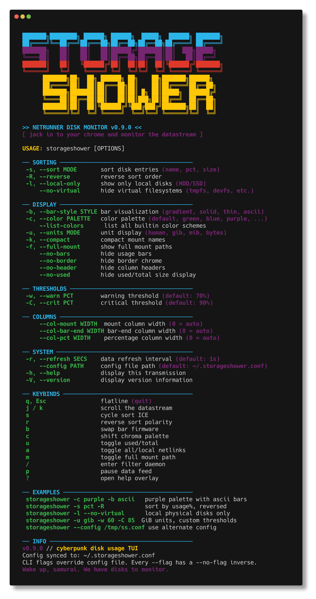
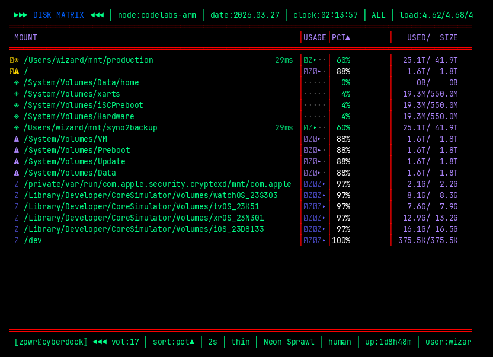
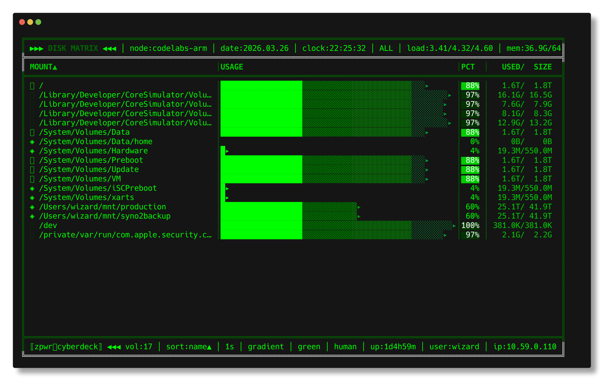
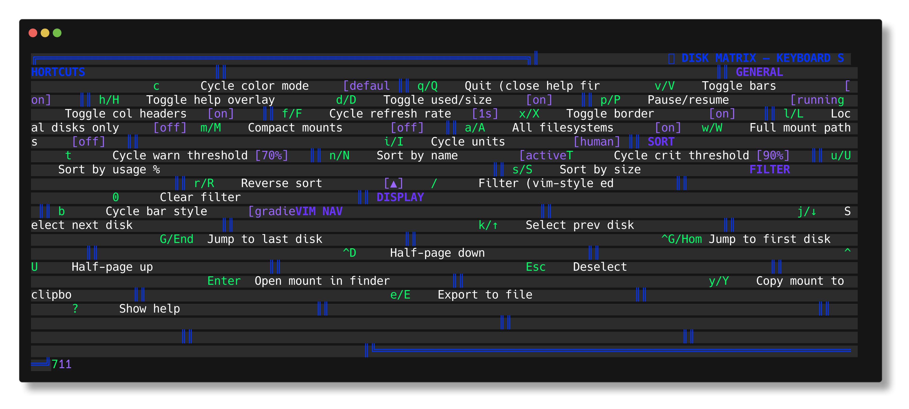

```
 ██████╗████████╗ ██████╗ ██████╗  █████╗  ██████╗ ███████╗
██╔════╝╚══██╔══╝██╔═══██╗██╔══██╗██╔══██╗██╔════╝ ██╔════╝
╚█████╗    ██║   ██║   ██║██████╔╝███████║██║  ███╗█████╗
 ╚═══██╗   ██║   ██║   ██║██╔══██╗██╔══██║██║   ██║██╔══╝
██████╔╝   ██║   ╚██████╔╝██║  ██║██║  ██║╚██████╔╝███████╗
╚═════╝    ╚═╝    ╚═════╝ ╚═╝  ╚═╝╚═╝  ╚═╝ ╚═════╝ ╚══════╝
███████╗██╗  ██╗ ██████╗ ██╗    ██╗███████╗██████╗
██╔════╝██║  ██║██╔═══██╗██║    ██║██╔════╝██╔══██╗
╚█████╗ ███████║██║   ██║██║ █╗ ██║█████╗  ██████╔╝
 ╚═══██╗██╔══██║██║   ██║██║███╗██║██╔══╝  ██╔══██╗
███████║██║  ██║╚██████╔╝╚███╔███╔╝███████╗██║  ██║
╚══════╝╚═╝  ╚═╝ ╚═════╝  ╚══╝╚══╝ ╚══════╝╚═╝  ╚═╝
```

<p align="center">
  <a href="https://github.com/MenkeTechnologies/storageshower/actions/workflows/ci.yml"></a>
  <a href="https://docs.rs/storageshower"></a>
  <a href="https://crates.io/crates/storageshower"></a>
  <a href="https://crates.io/crates/storageshower"></a>
  <a href="https://github.com/MenkeTechnologies/storageshower/blob/main/LICENSE"></a>
</p>

<p align="center">
  <code>[ SYSTEM://DISK_MATRIX v28.0 ]</code><br>
  <code> JACKING INTO YOUR FILESYSTEM </code><br><br>
  <strong>A neon-drenched terminal UI for monitoring disk usage</strong><br>
  <em>Built in Rust with <a href="https://github.com/ratatui/ratatui">ratatui</a> + <a href="https://github.com/crossterm-rs/crossterm">crossterm</a></em><br><br>
  <code>created by MenkeTechnologies</code>
</p>

<p align="center">
  
</p>


```bash
cargo install storageshower
```

---

```
 ▄▄▄▄▄▄▄▄▄▄▄▄▄▄▄▄▄▄▄▄▄▄▄▄▄▄▄▄▄▄▄▄▄▄▄▄▄▄▄▄▄▄▄▄▄▄▄▄▄▄▄
 █ >> INITIALIZING FEATURE MATRIX...                    █
 █ >> STATUS: ALL SYSTEMS NOMINAL                       █
 ▀▀▀▀▀▀▀▀▀▀▀▀▀▀▀▀▀▀▀▀▀▀▀▀▀▀▀▀▀▀▀▀▀▀▀▀▀▀▀▀▀▀▀▀▀▀▀▀▀▀▀
```

### `> FEATURE_DUMP.exe`

```
[RENDER_ENGINE]
  ├── Live disk usage display ─── color-coded progress bars
  │   ├── gradient ████▓▓▒▒░░
  │   ├── solid   █████████
  │   ├── thin    ▬▬▬▬▬▬▬▬▬
  │   └── ascii   #########
  │
[TELEMETRY_CORE]
  ├── Real-time system stats ─── load avg / memory / CPU
  │   ├── swap / process count / uptime
  │   ├── network IP / battery / TTY
  │   └── background thread @ 3s via Arc<Mutex<>>
  │
[ALERT_SUBSYSTEM]
  ├── Threshold alerts
  │   ├── ◈ NOMINAL ── all clear, choomba
  │   ├── ⚠ WARNING ── approaching redline
  │   └── ✖ CRITICAL ── flatlined
  │
[INTERFACE_DECK]
  ├── Sort ─── name / usage% / size / asc / desc
  ├── Filter ─── case-insensitive substring match
  ├── Units ─── human / GiB / MiB / raw bytes
  ├── Themes ─── 30 builtin + custom user themes (TOML)
  ├── Theme chooser ─── live preview with mouse click + keyboard nav
  ├── Theme editor ─── live color picker with per-channel control
  └── Persistent config ─── ~/.storageshower.conf (TOML)
  │
[DRILL_DOWN]
  ├── Directory explorer ─── Enter on any mount to drill in
  │   ├── recursive size calculation per directory
  │   ├── background scanning via Arc<Mutex<>>
  │   ├── breadcrumb navigation (Enter/Backspace/Esc)
  │   ├── sort by size or name (s/n/r keys)
  │   ├── progress bar with item count during scan
  │   └── gradient size bars relative to largest entry
  │
[NET_LATENCY]
  ├── Network filesystem latency ─── NFS/SMB/CIFS/SSHFS
  │   ├── timed read_dir with 2s timeout (no root needed)
  │   ├── color-coded badge: green(<50ms) / warn / red
  │   └── detects: nfs, nfs4, cifs, smbfs, afp, sshfs, s3fs, 9p
  │
[DISK_IO]
  ├── Live disk I/O throughput ─── per-mount read/write rates
  │   ├── macOS: IOKit IOBlockStorageDriver byte counters
  │   ├── Linux: /proc/diskstats sector counters
  │   ├── auto device→mount mapping via getmntinfo / /proc/mounts
  │   └── overlay on bar: ▲1.2M/s ▼500K/s (shown when active)
  │
[ALERT_ENGINE]
  ├── Disk free space alerts ─── threshold crossing detection
  │   ├── terminal bell (\x07) on newly crossed thresholds
  │   ├── pulsing red border flash for 2 seconds
  │   ├── dark red row highlight on alerting disks
  │   ├── status bar message: ⚠ ALERT: /mount 90%
  │   └── auto-clears when disk drops below threshold
  │
[SMART_HEALTH]
  ├── SMART drive health status ─── per-device monitoring
  │   ├── macOS: diskutil info SMART Status (Verified/Failing)
  │   ├── Linux: /sys/block/*/device/state
  │   ├── ✔ green for healthy, ✘ red for failing
  │   └── cached per base device, mapped to all mounts
  │
[PLATFORM_COMPAT]
  ├── macOS ── SUPPORTED
  ├── Linux ── SUPPORTED
  └── auto-detects battery, memory, TTY, local IP
```

---

### `> RENDER_PREVIEW.dat`

#### `// DEFAULT_THEME`

<p align="center">
  
</p>

#### `// GREEN_THEME`

<p align="center">
  
</p>

#### `// HELP_OVERLAY`

<p align="center">
  
</p>

---

### `> REQUIRED_IMPLANTS.cfg`

```
RUST_VERSION  >= 1.85  [2024 edition]
TARGET_OS     == macOS || Linux
```

| `IMPLANT` | `PURPOSE` |
|:---:|:---|
| `ratatui` 0.29 | TUI rendering framework |
| `crossterm` 0.28 | Terminal events + manipulation |
| `sysinfo` 0.32 | Disk / memory / CPU / proc intel |
| `clap` 4 | CLI argument parsing |
| `dirs` 5 | Home directory detection |
| `serde` 1 | Config serialization |
| `toml` 0.8 | Config file format |
| `libc` 0.2 | Unix syscalls (time, TTY) |

---

### `> COMPILE_SEQUENCE.sh`

```bash
# ── JACK IN ──────────────────────────────────
cargo build --release
# LTO enabled ── symbols stripped ── lean binary
```

```bash
# ── BOOT THE MATRIX ─────────────────────────
cargo run --release
# or go direct:
./target/release/storageshower
```

---

### `> CLI_OPTIONS.exe`

```
 ┌──────────────────────────────────────────────────┐
 │           ◈◈◈  COMMAND LINE DECK  ◈◈◈            │
 └──────────────────────────────────────────────────┘
```

CLI flags **override** config file settings. Every `--flag` has a `--no-flag` inverse
to force-override in either direction.

#### `// SORTING`

| `FLAG` | `DESCRIPTION` |
|:---|:---|
| `-s, --sort MODE` | Sort disk entries — `name`, `pct`, `size` |
| `-R, --reverse` / `--no-reverse` | Reverse sort order |
| `-l, --local-only` / `--no-local` | Show only local disks (HDD/SSD) |
| `--no-virtual` / `--virtual` | Hide/show virtual filesystems (tmpfs, devfs, etc.) |

#### `// DISPLAY`

| `FLAG` | `DESCRIPTION` |
|:---|:---|
| `-b, --bar-style STYLE` | Bar visualization — `gradient`, `solid`, `thin`, `ascii` |
| `-c, --color PALETTE` | Color palette — 30 builtins: `default`, `green`, `blue`, `purple`, `amber`, `cyan`, `red`, `sakura`, `matrix`, `sunset`, `neonnoir`, `chromeheart`, `bladerunner`, `voidwalker`, `toxicwaste`, `cyberfrost`, `plasmacore`, `steelnerve`, `darksignal`, `glitchpop`, `holoshift`, `nightcity`, `deepnet`, `lasergrid`, `quantumflux`, `biohazard`, `darkwave`, `overlock`, `megacorp`, `zaibatsu` |
| `--theme NAME` | Activate a custom theme by name (defined in config) |
| `--list-colors` | List all builtin color schemes with preview |
| `--export-theme` | Export current palette as TOML (combine with `-c` or `--theme`) |
| `-u, --units MODE` | Unit display — `human`, `gib`, `mib`, `bytes` |
| `-k, --compact` / `--no-compact` | Compact mount names |
| `-f, --full-mount` / `--no-full-mount` | Show full mount paths |
| `--bars` / `--no-bars` | Show/hide usage bars |
| `--border` / `--no-border` | Show/hide border chrome |
| `--header` / `--no-header` | Show/hide column headers |
| `--used` / `--no-used` | Show/hide used/total size display |
| `--tooltips` / `--no-tooltips` | Show/hide hover tooltips (right-click still works) |

#### `// THRESHOLDS`

| `FLAG` | `DESCRIPTION` |
|:---|:---|
| `-w, --warn PCT` | Warning threshold (default: 70%) |
| `-C, --crit PCT` | Critical threshold (default: 90%) |

#### `// COLUMNS`

| `FLAG` | `DESCRIPTION` |
|:---|:---|
| `--col-mount WIDTH` | Mount column width (0 = auto) |
| `--col-bar-end WIDTH` | Bar-end column width (0 = auto) |
| `--col-pct WIDTH` | Percentage column width (0 = auto) |

#### `// SYSTEM`

| `FLAG` | `DESCRIPTION` |
|:---|:---|
| `-r, --refresh SECS` | Data refresh interval (default: 1s) |
| `--config PATH` | Config file path (default: `~/.storageshower.conf`) |
| `-h, --help` | Display help transmission |
| `-V, --version` | Display version information |

#### `// EXAMPLES`

```bash
storageshower -c purple -b ascii     # purple palette with ascii bars
storageshower -s pct -R              # sort by usage%, reversed
storageshower -l --no-virtual        # local physical disks only
storageshower -u gib -w 60 -C 85    # GiB units, custom thresholds
storageshower --theme neonpink       # activate custom theme
storageshower --list-colors          # preview all builtin palettes
storageshower --export-theme -c blue # export blue palette as TOML
storageshower --config /tmp/ss.conf  # use alternate config
```

---

### `> KEYBIND_MATRIX.dat`

```
 ┌──────────────────────────────────────────────────┐
 │           ◈◈◈  COMMAND INTERFACE  ◈◈◈            │
 └──────────────────────────────────────────────────┘
```

#### `// GENERAL_OPS`

| `KEY` | `ACTION` |
|:---:|:---|
| `q` `Q` | Disconnect (or close help overlay) |
| `h` `H` `?` | Toggle help HUD |
| `p` `P` | Pause / resume data stream |
| `Esc` | Deselect current disk |

#### `// NAVIGATION`

| `KEY` | `ACTION` |
|:---:|:---|
| `j` `Down` | Select next disk |
| `k` `Up` | Select previous disk |
| `G` `End` | Jump to last disk |
| `Home` `Ctrl+g` | Jump to first disk |
| `Ctrl+d` | Half-page down |
| `Ctrl+u` | Half-page up |

#### `// SORT_PROTOCOL`

| `KEY` | `ACTION` |
|:---:|:---|
| `n` `N` | Sort by mount name (again to reverse) |
| `u` `U` | Sort by usage % (again to reverse) |
| `s` `S` | Sort by size (again to reverse) |
| `r` `R` | Reverse sort vector |

#### `// DISPLAY_MODS`

| `KEY` | `ACTION` |
|:---:|:---|
| `b` | Cycle bar style — gradient / solid / thin / ascii |
| `c` | Theme chooser popup — live preview, mouse click, scroll |
| `C` | Theme editor — live per-channel color picker |
| `v` `V` | Toggle usage bars |
| `d` `D` | Toggle used/size columns |
| `g` | Toggle column headers |
| `x` `X` | Toggle border chrome |
| `m` `M` | Compact mount names |
| `w` `W` | Full mount paths |
| `i` `I` | Cycle units — human / GiB / MiB / bytes |
| `f` `F` | Cycle refresh rate — 1s / 2s / 5s / 10s |
| `t` | Cycle warn threshold — 50 / 60 / 70 / 80% |
| `T` | Toggle hover tooltips (right-click still works) |
| `z` `Z` | Cycle crit threshold — 80 / 85 / 90 / 95% |

#### `// FILTER_OPS`

| `KEY` | `ACTION` |
|:---:|:---|
| `l` `L` | Local disks only |
| `a` `A` | Show all filesystems (incl. virtual) |
| `/` | Enter filter mode |
| `0` | Purge filter |

#### `// FILTER_EDIT_MODE`

| `KEY` | `ACTION` |
|:---:|:---|
| `Enter` | Confirm filter |
| `Esc` | Cancel filter |
| `Backspace` `Ctrl+h` | Delete char before cursor |
| `Delete` | Delete char at cursor |
| `Ctrl+w` | Delete word backward |
| `Ctrl+u` | Clear line before cursor |
| `Ctrl+k` | Delete to end of line |
| `Ctrl+a` `Home` | Cursor to start |
| `Ctrl+e` `End` | Cursor to end |
| `Ctrl+b` `Left` | Cursor left |
| `Ctrl+f` `Right` | Cursor right |

#### `// DISK_OPS`

| `KEY` | `ACTION` |
|:---:|:---|
| `Enter` | Drill down into selected mount |
| `o` `O` | Open selected mount in file manager |
| `y` `Y` | Copy mount path to clipboard |
| `e` `E` | Export disk matrix to file |
| `B` | Toggle bookmark (pin to top) |

#### `// DRILL_DOWN_MODE`

| `KEY` | `ACTION` |
|:---:|:---|
| `j` `k` | Navigate entries |
| `Enter` | Drill into selected directory |
| `Backspace` | Go up one level |
| `Esc` | Return to disk list |
| `s` `S` | Sort by size (again to reverse) |
| `n` `N` | Sort by name (again to reverse) |
| `r` `R` | Reverse sort direction |
| `o` `O` | Open current directory in file manager |
| `g` `G` | Jump to first / last entry |

#### `// THEME_EDITOR (C)`

| `KEY` | `ACTION` |
|:---:|:---|
| `j` `k` | Select color channel |
| `h` `l` | Adjust value ±1 |
| `H` `L` | Adjust value ±10 |
| `Enter` `s` | Save (prompts for name) |
| `Esc` `q` | Cancel |

#### `// MOUSE_INPUT`

| `ACTION` | `EFFECT` |
|:---:|:---|
| `Left-click` disk row | Select disk |
| `Left-click` selected disk | Drill down into mount |
| `Left-click` column header | Cycle sort on that column |
| `Left-click` theme chooser row | Select and preview theme |
| `Left-click` outside theme popup | Cancel and revert theme |
| `Left-drag` column separator | Resize mount / pct / right columns |
| `Right-click` disk row | Verbose tooltip: capacity, rank, headroom, SMART, I/O |
| `Right-click` drill-down entry | Verbose tooltip: size, rank, share bar, depth, sort |
| `Hover` title segment | Per-segment tooltip: node, date, load, mem, cpu, etc. (auto-hides after 3s) |
| `Hover` footer segment | Per-segment tooltip: sort, theme, units, uptime, etc. (auto-hides after 3s) |
| `Scroll wheel` | Select next/prev disk (or drill-down / theme entry) |

---

### `> BENCHMARK_TELEMETRY.dat`

```
 ┌──────────────────────────────────────────────────┐
 │         ◈◈◈  PERFORMANCE MATRIX  ◈◈◈            │
 └──────────────────────────────────────────────────┘
```

Measured with [Criterion.rs](https://github.com/bheisler/criterion.rs) on Apple Silicon (M-series).

#### `// CORE_FORMATTING`

| `BENCHMARK` | `TIME` |
|:---|---:|
| `format_bytes` (Human, 1 GiB) | `~67 ns` |
| `format_bytes` (GiB, 1 GiB) | `~69 ns` |
| `format_bytes` (Bytes, zero) | `~20 ns` |
| `format_uptime` (45m) | `~21 ns` |
| `format_uptime` (2d14h) | `~39 ns` |
| `truncate_mount` (w=8) | `~27 ns` |
| `truncate_mount` (w=32) | `~97 ns` |

#### `// LAYOUT_ENGINE`

| `BENCHMARK` | `TIME` |
|:---|---:|
| `mount_col_width` | `~590 ps` |
| `right_col_width_static` | `~540 ps` |

#### `// COLOR_PIPELINE`

| `BENCHMARK` | `TIME` |
|:---|---:|
| `palette` | `~2.4 ns` |
| `gradient_color_at` | `~0.7–1.1 ns` |

#### `// TIME_OPS`

| `BENCHMARK` | `TIME` |
|:---|---:|
| `epoch_to_local` | `~300 ns` |
| `chrono_now` | `~427 ns` |

#### `// DATA_COLLECTION`

| `BENCHMARK` | `TIME` |
|:---|---:|
| `collect_disk_entries` | `~3.2 µs` |
| `collect_sys_stats` | `~3.8 µs` |

#### `// CONFIG_SERDE`

| `BENCHMARK` | `TIME` |
|:---|---:|
| `prefs serialize` (TOML) | `~4.6 µs` |
| `prefs deserialize` (TOML) | `~5.3 µs` |

#### `// SORT_DISKS`

| `BENCHMARK` | `10` | `50` | `200` |
|:---|---:|---:|---:|
| `by_name` | `270 ns` | `1.7 µs` | `7.9 µs` |
| `by_pct` | `242 ns` | `1.2 µs` | `4.3 µs` |
| `by_size` | `250 ns` | `1.2 µs` | `4.2 µs` |

#### `// FILTER_DISKS`

| `BENCHMARK` | `10` | `50` | `200` |
|:---|---:|---:|---:|
| `substring_match` | `291 ns` | `1.6 µs` | `5.9 µs` |
| `no_match` | `151 ns` | `746 ns` | `3.0 µs` |

#### `// RENDER_PIPELINE`

| `BENCHMARK` | `TIME` |
|:---|---:|
| `format_all_disks` (10) | `~1.5 µs` |
| `format_all_disks` (50) | `~4.4 µs` |
| `format_all_disks` (200) | `~15.7 µs` |

```bash
# ── RUN TESTS ──────────────────────────────────
cargo test
# Library unit tests: #[cfg(test)] modules under src/
# Integration tests: cargo test --tests  (each tests/*.rs = separate binary)
#   Areas: CLI parsing/smoke (cli_*), prefs load/roundtrip (prefs_*), App/columns (app_*),
#   scan_directory + progress (scan_*), helpers invariants (helpers_*), public helpers API
#   (helpers_public_api_*), dedup_disk_totals (dedup_* + dedup_disk_totals_integration),
#   prefs TOML/custom themes (prefs_custom_themes_*), system API smoke (system_public_api_*),
#   core types enums (types_core_enums_*), filter+bookmark combos (app_filter_bookmark_*),
#   sort rev Pct/Size (app_sort_rev_pct_size_*), serde JSON types (serde_json_public_types_*),
#   clipboard API (copy_to_clipboard_*), CLI apply bundles (cli_apply_bundles_*),
#   show_local + filter (app_show_local_*), prefs vs CLI merge (prefs_merge_cli_*),
#   short flags (cli_short_flags_*), CLI inverse prefs (cli_inverse_prefs_*),
#   bookmarks + sort modes (app_bookmarks_sort_modes_*), prefs TOML flags (prefs_toml_flags_*),
#   CLI meta flags (cli_meta_flags_*), dedup deep cases (dedup_disk_totals_deep_*),
#   helpers format tables (helpers_format_table_*), column width / threshold edges (cli_width_threshold_*),
#   scan_directory nested dirs (scan_directory_nested_*), ColorMode cycle (types_color_mode_cycle_*),
#   filter path shapes (app_filter_paths_*), binary smoke (cli_binary_more_smoke_*),
#   prefs active_theme TOML (prefs_toml_active_theme_*), truncate_mount edges (helpers_truncate_*),
#   DiskEntry fields (types_disk_entry_*), scan progress partial callbacks (scan_directory_progress_partial_*),
#   deep CLI stacks (cli_apply_deep_stack_*), bookmarks+sort_rev (app_bookmarks_sort_rev_*),
#   prefs TOML many bookmarks (prefs_toml_bookmarks_many_*), binary export/list (cli_binary_export_list_*),
#   helpers latency/rate edges (helpers_latency_rate_*), uptime edges (helpers_uptime_*),
#   prefs TOML sort modes (prefs_toml_sort_modes_*), dedup order behavior (dedup_disk_totals_order_*),
#   scan dotfiles (scan_directory_dotfile_*), CLI misc apply (cli_misc_parse_apply_*),
#   prefs TOML bar style (prefs_toml_bar_style_*), binary warn/crit (cli_binary_warn_crit_*),
#   format_bytes unit modes (helpers_format_bytes_modes_*), three-mount sort (app_sort_three_mounts_*),
#   BarStyle JSON (types_bar_style_json_*),
#   UI palette / gradient (ui_palette_gradient_*), prefs TOML column widths (prefs_toml_column_widths_*),
#   chrono_now / epoch_to_local (system_time_local_*), columns width API (columns_public_width_*),
#   CLI column apply (cli_apply_column_widths_*),
#   ColorMode / SortMode JSON (types_color_mode_json_roundtrip_*, types_sort_mode_json_roundtrip_*),
#   CLI theme/tooltips/virtual apply (cli_apply_theme_tooltips_virtual_*),
#   prefs TOML show_tooltips/show_all (prefs_toml_show_tooltips_show_all_*),
#   scan empty dir (scan_directory_empty_dir_*), binary theme/virtual/tooltips (cli_binary_theme_virtual_tooltips_*),
#   human tera boundary (helpers_human_tera_boundary_*), empty sorted disks (app_update_sorted_empty_disks_*),
#   CLI positive chrome flags (cli_apply_positive_chrome_flags_*), prefs TOML refresh_rate (prefs_toml_refresh_rate_*),
#   prefs TOML unit_mode strings (prefs_toml_unit_mode_strings_*), scan one/two files (scan_directory_one_file_*),
#   network FS case (is_network_fs_case_*), get_local_ip (system_get_local_ip_*), multi-G/s format_rate (helpers_format_rate_multi_gig_*),
#   binary compact/reverse/sort (cli_binary_compact_reverse_sort_*), CLI --config parse (cli_config_flag_parsed_*),
#   equal-total size sort stability (app_sort_equal_total_stable_*),
#   UI unknown active_theme fallback (ui_palette_unknown_active_theme_fallback_*), get_username vs env (system_get_username_env_*),
#   prefs TOML thresh edges (prefs_toml_thresh_edge_*), CLI apply warn/crit (cli_apply_warn_crit_*),
#   scan progress both mutexes (scan_directory_progress_both_mutexes_*), binary warn/crit/export (cli_binary_warn_crit_export_theme_*),
#   dedup mixed mounts (dedup_disk_totals_mixed_mounts_*), human K boundary (helpers_human_kilo_boundary_*),
#   pct sort rev three mounts (app_sort_pct_three_mounts_*), prefs TOML empty bookmarks (prefs_toml_bookmarks_empty_*),
#   CLI sort+refresh+bar (cli_apply_sort_refresh_bar_*),
#   scan missing path (scan_directory_missing_path_*), CLI hyphenated color (cli_apply_color_hyphenated_*),
#   CLI units all (cli_apply_units_all_*), UnitMode JSON (types_unit_mode_json_roundtrip_*),
#   gradient_color_at boundaries (ui_gradient_color_at_boundaries_*), uptime multi-day (helpers_uptime_multi_day_*),
#   binary hyphenated color (cli_binary_color_hyphen_smoke_*), TOML inline custom themes (toml_custom_theme_inline_deserialize_*),
#   four bookmarks (app_bookmarks_four_mounts_*),
#   ColorMode next cycle (types_color_mode_next_cycle_*), CLI bar styles (cli_apply_bar_style_all_*),
#   binary bar-style stacks (cli_binary_bar_style_stack_*), prefs TOML compact/full_mount (prefs_toml_compact_full_mount_*),
#   scan three files (scan_directory_three_files_*), CLI inverse bundles (cli_apply_inverse_flags_bundle_*),
#   Unicode filter (app_filter_unicode_mount_*), chrono_now shape (system_chrono_now_shape_*),
#   latency seconds branch (helpers_format_latency_second_branch_*), right col pct override (columns_right_col_pct_override_*),
#   network FS detection (is_network_fs_*), theme JSON (theme_colors_json_*), etc.
# Test counts: `cargo test --locked` prints `running N tests` per target; sum those lines, or run
#   cargo test --locked -- --list | wc -l
#   for an approximate listed-test count (includes lib + integration + names; doc tests run separately).

# ── RUN BENCHMARKS ─────────────────────────────
cargo bench
# results in target/criterion/
```

#### `// CI_PIPELINE`

[GitHub Actions](.github/workflows/ci.yml) runs on every push and pull request to `main`, on [merge queue](https://docs.github.com/en/pull-requests/collaborating-with-pull-requests/incorporating-changes-from-a-pull-request/merging-a-pull-request-with-a-merge-queue) batches (when enabled), and can be run manually via **Actions → CI → Run workflow** (`workflow_dispatch`).

| Job | What it runs |
|:---|:---|
| **Check** | `cargo check --locked --all-targets` on Ubuntu and macOS |
| **Test** | `cargo test --locked --lib`, then `--tests` (one integration binary per `tests/*.rs`), then `--doc` on Ubuntu and macOS |
| **Format** | `cargo fmt --all --check` on Ubuntu |
| **Clippy** | `cargo clippy --locked --all-targets -- -D warnings` on Ubuntu |

The `--locked` flag fails the job if `Cargo.lock` is out of sync with `Cargo.toml`, so CI always resolves the same dependency graph as a fresh clone with a committed lockfile. The lockfile is checked into this repository; if your machine’s global gitignore ignores `Cargo.lock`, run `git add -f Cargo.lock` after changing dependencies so updates are not missed.

Concurrent runs for the same branch are cancelled when a newer commit is pushed (`concurrency.cancel-in-progress`). The workflow uses least-privilege `contents: read` permissions.

Matrix jobs (**Check**, **Test**) use `fail-fast: false` so a failure on one OS still runs the other. Each job has a wall-clock **timeout** (30 minutes for build/test/clippy, 10 minutes for format) so hung runners cannot burn minutes indefinitely.

The **Test** job sets `RUST_BACKTRACE=1` so panics print a full stack trace in the Actions log (useful when a test fails only on one OS).

All jobs inherit `CARGO_NET_RETRY=2` so Cargo retries failed network fetches (crates.io / git dependencies) when the network or registry is slow.

Disk enumeration (`collect_disk_entries`) omits rows with an empty mount path so the TUI never shows blank mounts (this also avoids flaky tests on macOS CI when the OS reports odd mount table entries).

To match CI locally before pushing:

```bash
cargo fmt --all --check && cargo clippy --locked --all-targets -- -D warnings && cargo test --locked --lib && cargo test --locked --tests && cargo test --locked --doc
```

To run **all** tests (library + integration + doc) in one command: `cargo test --locked`.

---

### `> CONFIG_PERSISTENCE.log`

```
 ┌──────────────────────────────────────────────────────┐
 │  ALL PREFS AUTO-SAVED TO ~/.storageshower.conf       │
 │  FORMAT: TOML ── RESTORED ON BOOT ── ZERO EDIT       │
 │                                                        │
 │  >> sort mode    >> sort direction   >> show all       │
 │  >> refresh rate >> bar style        >> color mode      │
 │  >> warn/crit    >> bar visibility   >> border          │
 │  >> col headers  >> compact mode     >> mount paths     │
 │  >> show used    >> show local       >> custom widths   │
 │  >> mount col w  >> right col w      >> pct col w       │
 │  >> custom themes (HashMap)         >> active theme    │
 │  >> bookmarks (Vec<String>)                           │
 └──────────────────────────────────────────────────────┘
```

---

### `> CUSTOM_THEMES.cfg`

```
 ┌──────────────────────────────────────────────────┐
 │          ◈◈◈  THEME SYSTEM  ◈◈◈                 │
 └──────────────────────────────────────────────────┘
```

30 builtin palettes including: **Neon Sprawl** · **Acid Rain** · **Ice Breaker** · **Synth Wave** · **Rust Belt** · **Ghost Wire** · **Red Sector** · **Sakura Den** · **Data Stream** · **Solar Flare** · **Neon Noir** · **Chrome Heart** · **Blade Runner** · **Void Walker** · **Toxic Waste** · **Cyber Frost** · **Plasma Core** · **Steel Nerve** · **Dark Signal** · **Glitch Pop** + 10 more

Create your own by adding to `~/.storageshower.conf`:

```toml
[custom_themes.neonpink]
blue         = 199
green        = 46
purple       = 201
light_purple = 213
royal        = 196
dark_purple  = 161

active_theme = "neonpink"
```

Or use the **in-app theme editor** (`C` key) to tweak colors live and save.

See `themes/` for all builtin palettes as ready-to-copy TOML files.

---

<p align="center">
  <code> END OF LINE </code><br>
  <code>// THE STREET FINDS ITS OWN USES FOR DISK SPACE //</code>
</p>
